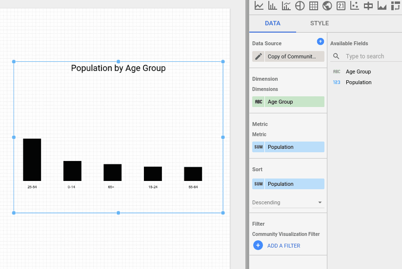
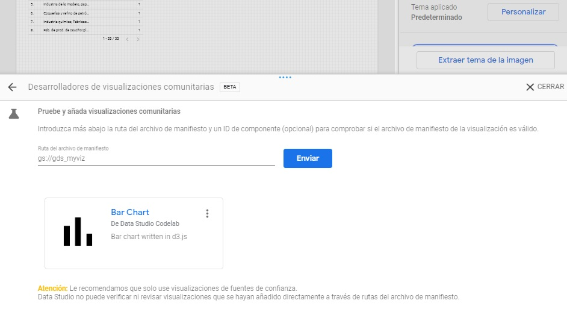

# Community Visualization Codelab 1
Codelab url: https://codelabs.developers.google.com/codelabs/community-visualization/#0

## Contents
* How a Google Data Studio community visualization works
* How to build a community visualization using the ds-component helper library
* How to integrate your community visualization into a Data Studio dashboard
What you'll need

## Requirements
* Access to the internet and a web browser
* A Google account
* Access to a Google Cloud Platform storage bucket
* Familiarity with Javascript

## Project
Creating a bar chart community visualization that supports 1 dimension, 1 metric, and bar color style. </br>


### 1. File schema
To create a community visualization, you need the following files in a Google Cloud Platform storage bucket, which you will create in a later step.

| Filename       | Filetype | Purpose                                                                             |
|----------------|----------|-------------------------------------------------------------------------------------|
| manifest.json* | JSON     | Provides metadata about the visualization and the location of the other resources| |
| myViz.json | JSON     | Provides data and style configuration options for the Property panel |
| myViz.js | JavaScript     | Provides the JavaScript code required for displaying the visualization |
| myViz.css (optional) | CSS     | Provides styling for the visualization. |
*The manifest is the only file that has a required name. The other files can be named differently, as long as their name/location is specified in your manifest file.

### 2. Write the visualization JavaScript file
In this section, you'll add the code required to handle data, style changes, and visualization rendering into your JavaScript file. 
#### 2.1 Write the visualization source <br>
**Step 1:** Download the dscc.min.js file from the [Data Studio Community Component Library](https://raw.githubusercontent.com/googledatastudio/tooling/master/packages/ds-component/_bundles/dscc.min.js) and copy it to your working directory.

**Step 2:** Copy the following code into a text editor and save it as `myVizSource.js` in your local working directory.

myVizSource.js
```js
function drawViz(data) {

  // set margins + canvas size
  const margin = { top: 10, bottom: 50, right: 10, left: 10 };
  const height = dscc.getHeight() - margin.top - margin.bottom;
  const width = dscc.getWidth() - margin.left - margin.right;

  // remove the svg if it already exists
  if (document.querySelector("svg")) {
    let oldSvg = document.querySelector("svg");
    oldSvg.parentNode.removeChild(oldSvg);
  }

  const svg = document.createElementNS("http://www.w3.org/2000/svg", "svg");
  svg.setAttribute("height", `${height}px`);
  svg.setAttribute("width", `${width}px`);

  const rect = document.createElementNS("http://www.w3.org/2000/svg", "rect");
  rect.setAttribute('width', `${width/2}px`);
  rect.setAttribute('height', `${height/2}px`);
  rect.style.fill =  'blue';

  svg.append(rect);

  document.body.appendChild(svg);
}
// subscribe to data and style changes
dscc.subscribeToData(drawViz, { transform: dscc.objectTransform });
```
#### 2.2 Concatenate code
Combine all JavaScript required into a single file by copying the contents of the visualization helper library (`dscc.min.js`) and your `myVizSource.js` file into a new file named `myViz.js`. Run the following commands to concatenate the files.<br>
**IMPORTANT NOTE: Repeat this step each time you update your visualization code.**

**Linux/Mac OS concatenation script**
```shell script
cat dscc.min.js > myViz.js
echo >> myViz.js
cat myVizSource.js >> myViz.js
```
**Windows script ``concatenate.bat``** 
```shell script
del myViz.js
type nul > myViz.js
type dscc.min.js >> myViz.js
echo.>> myViz.js
type myVizSource.js >> myViz.js
```
### 3. Write the visualization JavaScript file
myViz.css
```css
#myVizTitle {
  color: black;
  font-size: 24px;
  text-align: center;
  margin: 0 auto;
}
```

### 4. Write the JSON config
The visualization config json file defines the data and style attributes supported and required by your visualization. This visualization you'll build in this codelab supports one dimension and one metric, and requires one style element to select a color. [Learn more about dimensions and metrics](https://support.google.com/datastudio/answer/6402048?hl=en).

Copy the following code and save it as ``myViz.json``. To learn more about the properties you can configure, visit the [config reference](https://developers.google.com/datastudio/visualization/config-reference) documentation.

myViz.json
````json
{
  "data": [
    {
      "id": "concepts",
      "label": "Concepts",
      "elements": [
        {
          "id": "barDimension",
          "label": "Dimension",
          "type": "DIMENSION",
          "options": {
            "min": 1,
            "max": 1
          }
        },
        {
          "id": "barMetric",
          "label": "Metric",
          "type": "METRIC",
          "options": {
            "min": 1,
            "max": 1
          }
        }
      ]
    }
  ],
  "style": [
    {
      "id": "color",
      "label": "Colors",
      "elements": [
        {
          "type": "FONT_COLOR",
          "id": "barColor",
          "label": "Bar Color",
          "defaultValue": "#222222"
        }
      ]
    }
  ]
}
````
### 5. Set up a storage bucket in Google Cloud

The files must be accessible from a Google Storage Bucket in order to integrate them to Google Data Studio.
#### 5.1 Create a project
Access your Google Cloud and create a new project, we will call this one ``gdstutorial1``
#### 5.2 Create a bucket
At the "Storage" tab, we will create a bucket ``gds_myviz``.<br>
* Location:  **Region**, *us-east1*.<br>
* Default storage class: Standard storage.<br>
* Access to levels: Fine grained.<br>
* Advanced settings: Leave as they are<br>

### 6. Write the manifest.json file

The manifest file provides information about your visualization location and resources.
It must be named "``manifest.json``", and it must be located in the bucket created in the previous step (``gds_myviz``).<br>
To learn more about the manifest, visit the [manifest reference documentation](https://developers.google.com/datastudio/visualization/manifest-reference).<br>
Copy the following code into a text editor and save it as ``manifest.json``.<br>

manifest.json
```json
{
  "name": "Community Visualization",
  "logoUrl": "https://raw.githubusercontent.com/googledatastudio/community-visualizations/master/docs/codelab/img/bar_chart.png",
  "organization": "Data Studio Codelab",
  "supportUrl": "https://url",
  "packageUrl": "https://url",
  "privacyPolicyUrl": "https://url",
  "description": "Community Visualization Codelab",
  "devMode": true,
  "components": [{
    "id": "barChart",
    "name": "Bar Chart",
    "iconUrl": "https://raw.githubusercontent.com/googledatastudio/community-visualizations/master/docs/codelab/img/bar_chart.png",
    "description": "Bar chart written in d3.js",
    "resource": {
      "js": "gs://gds_myviz/myViz.js",
      "config": "gs://gds_myviz/myViz.json",
      "css": "gs://gds_myviz/myViz.css"
    }
  }]
}
```
### 7.Upload your visualization files to Google Cloud Storage
You can either upload the files using the web interface or the CLI.
>In any case, you must make sure they have **public access**

#### Uploading using the CLI
cd to the folder in which the files are and use the following commnds:
````shell script
gsutil cp -a public-read manifest.json gs://gds_myviz
gsutil cp -a public-read myViz.* gs://gds_myviz
````

### 8.Test your Community Visualization in Data Studio
Create a new Google Data Studio report with a barplot-friendly data source (Google Sheets connector is the simplest option).
Include the bucket link as follows ``gs://gds_myviz`` </br>



