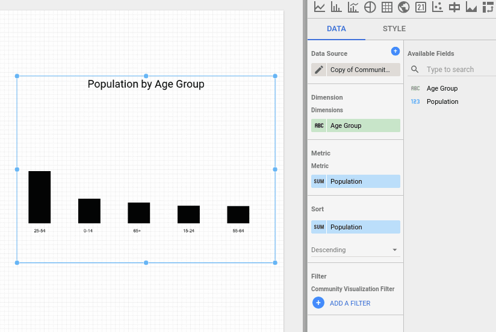
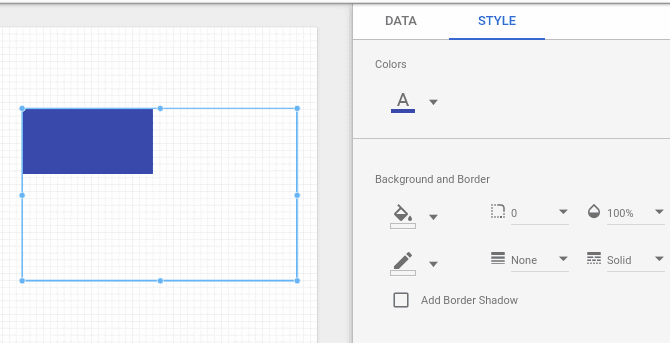
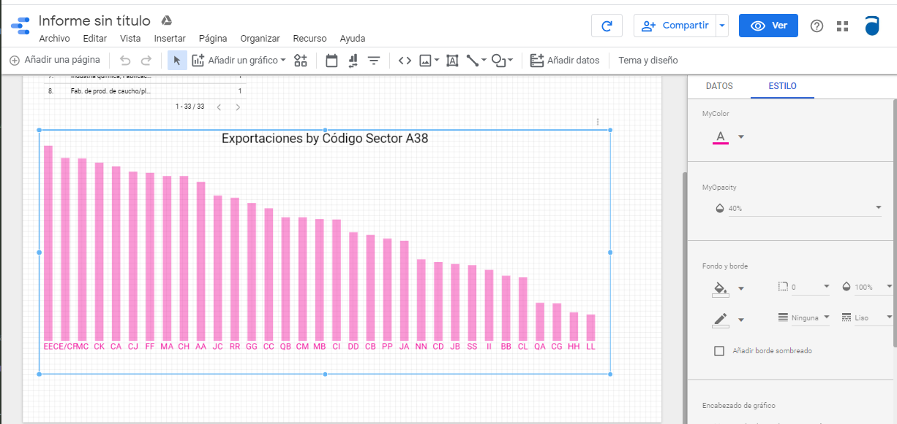

# Community Visualization Codelab 2
Codelab url: https://codelabs.developers.google.com/codelabs/community-visualization/#11

## Contents
* How to add style to a graph
* How to select a custom plot type
## Requirements
* Same ones as in Codelab 1
* Codelab 1 completed
## Project
Creating a bar chart community visualization that supports 1 dimension, 1 metric, bar color style and opacity. </br>


### 1. Use the color selector style element
Based on ``myVizSource.js`` from last tutorial, we are going to add the ``fillColor`` const and switch ``rect.style.fill`` to it.
```js
function drawViz(data) {

  // set margins + canvas size
  const margin = { top: 10, bottom: 50, right: 10, left: 10 };
  const height = dscc.getHeight() - margin.top - margin.bottom;
  const width = dscc.getWidth() - margin.left - margin.right;

  // remove the svg if it already exists
  if (document.querySelector("svg")) {
    let oldSvg = document.querySelector("svg");
    oldSvg.parentNode.removeChild(oldSvg);
  }

  const svg = document.createElementNS("http://www.w3.org/2000/svg", "svg");
  svg.setAttribute("height", `${height}px`);
  svg.setAttribute("width", `${width}px`);

  const fillColor =  data.style.barColor.value
  ? data.style.barColor.value.color
  : data.style.barColor.defaultValue;

  const rect = document.createElementNS("http://www.w3.org/2000/svg", "rect");
  rect.setAttribute('width', `${width/2}px`);
  rect.setAttribute('height', `${height/2}px`);
  rect.style.fill =  fillColor;
  svg.append(rect);

  document.body.appendChild(svg);
}
// subscribe to data and style changes
dscc.subscribeToData(drawViz, { transform: dscc.objectTransform });
```
Create the combined JavaScript file, and re-upload your visualization files to Google Cloud Storage. Then, refresh the Data Studio report where you tested your community visualization. <br/>
You should be able to change the color of the rectangle using the selector in the style menu.<br/>


### 2. Render the data as a bar chart
Replace the code in your ``myVizSource.js`` file with the code below.
```js
function drawViz(data) {
  let rowData = data.tables.DEFAULT;

  // set margins + canvas size
  const margin = { top: 10, bottom: 50, right: 10, left: 10 };
  const padding = { top: 15, bottom: 15 };
  const height = dscc.getHeight() - margin.top - margin.bottom;
  const width = dscc.getWidth() - margin.left - margin.right;

  // remove the svg if it already exists
  if (document.querySelector("svg")) {
    let oldSvg = document.querySelector("svg");
    oldSvg.parentNode.removeChild(oldSvg);
  }

  const svg = document.createElementNS("http://www.w3.org/2000/svg", "svg");
  svg.setAttribute("height", `${height}px`);
  svg.setAttribute("width", `${width}px`);

  const fillColor =  data.style.barColor.value
  ? data.style.barColor.value.color
  : data.style.barColor.defaultValue;

  const maxBarHeight = height - padding.top - padding.bottom;
  const barWidth = width / (rowData.length * 2);

  // obtain the maximum bar metric value for scaling purposes
  let largestMetric = 0;

  rowData.forEach(function(row) {
    largestMetric = Math.max(largestMetric, row["barMetric"][0]);
  });

  rowData.forEach(function(row, i) {
    // 'barDimension' and 'barMetric' come from the id defined in myViz.json
    // 'dimId' is Data Studio's unique field ID, used for the filter interaction
    const barData = {
      dim: row["barDimension"][0],
      met: row["barMetric"][0],
      dimId: data.fields["barDimension"][0].id
    };

    // calculates the height of the bar using the row value, maximum bar
    // height, and the maximum metric value calculated earlier
    let barHeight = Math.round((barData["met"] * maxBarHeight) / largestMetric);

    // normalizes the x coordinate of the bar based on the width of the convas
    // and the width of the bar
    let barX = (width / rowData.length) * i + barWidth / 2;

    // create the "bar"
    let rect = document.createElementNS("http://www.w3.org/2000/svg", "rect");
    rect.setAttribute("x", barX);
    rect.setAttribute("y", maxBarHeight - barHeight);
    rect.setAttribute("width", barWidth);
    rect.setAttribute("height", barHeight);
    rect.setAttribute("data", JSON.stringify(barData));
    rect.style.fill = fillColor;
    svg.appendChild(rect);

    // add text labels
    let text = document.createElementNS("http://www.w3.org/2000/svg", "text");
    let textX = barX + barWidth / 2;
    text.setAttribute("x", textX);
    text.setAttribute("text-anchor", "middle");
    let textY = maxBarHeight + padding.top;
    text.setAttribute("y", textY);
    text.setAttribute("fill", fillColor)
    text.innerHTML = barData["dim"];

    svg.appendChild(text);
  });

  document.body.appendChild(svg);
}

// subscribe to data and style changes
dscc.subscribeToData(drawViz, { transform: dscc.objectTransform });
```

Here, we have added the following:

1. Padding for the graph.
2. Defined the constraints for the bars to be rendered through ``maxBarHeight`` and ``barWidth``.
3. Defined the ``largestMetric`` for scaling purposes.
4. "Plugged" the data from metrics and styles in ``myViz.json`` to the rendering.
5. Rendered the bars according to the source data in a loop.
6. Placed a label containing the title of the dimension below each bar.

### 3. Dynamically add a title and apply a CSS style
Replace the code in your ``myVizSource.js`` file with the code below.
```js
// create a title element
var titleElement = document.createElement('div');
titleElement.id = 'myVizTitle';
document.body.appendChild(titleElement);

function drawViz(data) {
  let rowData = data.tables.DEFAULT;

  // set margins + canvas size
  const margin = { top: 10, bottom: 50, right: 10, left: 10 };
  const padding = { top: 15, bottom: 15 };
  const height = dscc.getHeight() - margin.top - margin.bottom;
  const width = dscc.getWidth() - margin.left - margin.right;

  const fillColor =  data.style.barColor.value
  ? data.style.barColor.value.color
  : data.style.barColor.defaultValue;

  // remove the svg if it already exists
  if (document.querySelector("svg")) {
    let oldSvg = document.querySelector("svg");
    oldSvg.parentNode.removeChild(oldSvg);
  }

  const svg = document.createElementNS("http://www.w3.org/2000/svg", "svg");
  svg.setAttribute("height", `${height}px`);
  svg.setAttribute("width", `${width}px`);

  const maxBarHeight = height - padding.top - padding.bottom;
  const barWidth = width / (rowData.length * 2);

  // obtain the maximum bar metric value for scaling purposes
  let largestMetric = 0;

  rowData.forEach(function (row) {
    largestMetric = Math.max(largestMetric, row["barMetric"][0]);
  });

  rowData.forEach(function (row, i) {
    // 'barDimension' and 'barMetric' come from the id defined in myViz.json
    // 'dimId' is Data Studio's unique field ID, used for the filter interaction
    const barData = {
      dim: row["barDimension"][0],
      met: row["barMetric"][0],
      dimId: data.fields["barDimension"][0].id
    };

    // calculates the height of the bar using the row value, maximum bar
    // height, and the maximum metric value calculated earlier
    let barHeight = Math.round((barData["met"] * maxBarHeight) / largestMetric);

    // normalizes the x coordinate of the bar based on the width of the convas
    // and the width of the bar
    let barX = (width / rowData.length) * i + barWidth / 2;

    // create the "bar"
    let rect = document.createElementNS("http://www.w3.org/2000/svg", "rect");
    rect.setAttribute("x", barX);
    rect.setAttribute("y", maxBarHeight - barHeight);
    rect.setAttribute("width", barWidth);
    rect.setAttribute("height", barHeight);
    rect.setAttribute("data", JSON.stringify(barData));
    // use style selector from Data Studio
    rect.style.fill = fillColor;
    svg.appendChild(rect);

    // add text labels
    let text = document.createElementNS("http://www.w3.org/2000/svg", "text");
    let textX = barX + barWidth / 2;
    text.setAttribute("x", textX);
    text.setAttribute("text-anchor", "middle");
    let textY = maxBarHeight + padding.top;
    text.setAttribute("y", textY);
    text.setAttribute("fill", fillColor)
    text.innerHTML = barData["dim"];

    svg.appendChild(text);
  });

  document.body.appendChild(svg);

  // Get the human-readable name of the metric and dimension

  var metricName = data.fields['barMetric'][0].name;
  var dimensionName = data.fields['barDimension'][0].name;

  titleElement.innerText = metricName + ' by ' + dimensionName;

}

dscc.subscribeToData(drawViz, { transform: dscc.objectTransform });
```

Here, we just added a title to show the name of the metric and the dimension.

### 4. Add opacity to the bars
According to the [Community Visualization Config Reference](https://developers.google.com/datastudio/visualization/config-reference#dataelement), we can include a new style element in ``myViz.json`` to display opacity.
In order to do so, we must use the "OPACITY" selector attached to the element list of the style dictionary, just as follows:
```json
{
  "style": [
    {
      "id": "opacity",
      "label": "MyOpcity",
      "elements": [
        {
          "type": "OPACITY",
          "id": "barOpacity",
          "label": "MyBarOpacity",
          "defaultValue": "0.2"
        }
      ]
    }
  ]
}
```

Also, once the selector is added, we must make our js script catch those values.
```js
    const fillOpacity = data.style.barOpacity.value
        ? data.style.barOpacity.value
        : data.style.barOpacity.defaultValue;
```
```js
        let rect = document.createElementNS("http://www.w3.org/2000/svg", "rect");
        rect.setAttribute("x", barX);
        rect.setAttribute("y", maxBarHeight - barHeight);
        rect.setAttribute("width", barWidth);
        rect.setAttribute("height", barHeight);
        rect.setAttribute("data", JSON.stringify(barData));
        // use style selector from Data Studio
        rect.style.fill = fillColor;
        rect.style.opacity = fillOpacity;
        svg.appendChild(rect);
```

