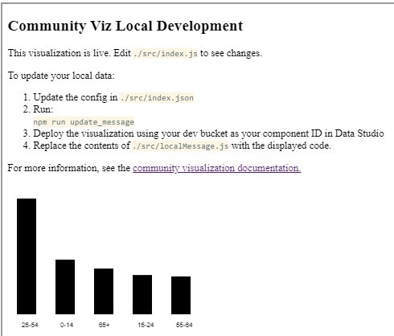
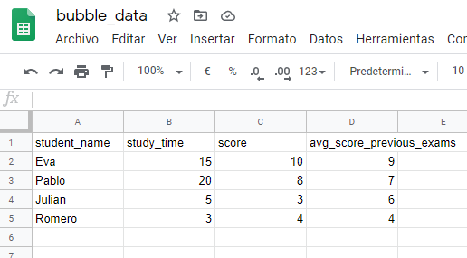
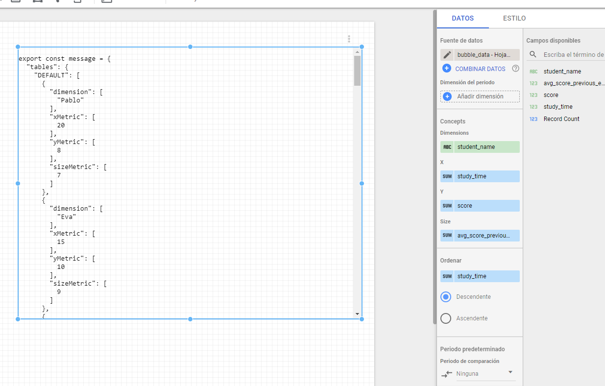
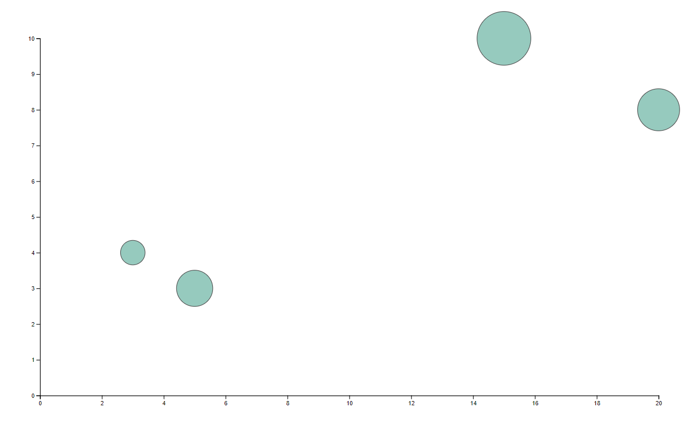

# Community Visualization Codelab 3
Codelab url: https://codelabs.developers.google.com/codelabs/community-visualization-dscc-gen/index.html?index=..%2F..index#0

## Contents
* How to build a Community Visualization with dscc-gen

## Requirements
* Familiarity with Javascript, Node.js, and the command-line
* Codelab 1 & 2 completed

## Project: Part 1
Create Data Studio Community Visualizations with dscc-gen.

### 1. Setup dscc-gen
**dscc-gen** is a command-line tool that provides opinionated templates and workflows for Community Visualizations and Community Connectors. The Community Visualization template provides a working visualization and a workflow that allows you to immediately see your visualization code changes, and scripts to validate, build, and deploy your visualizations.

**dscc-gen** uses gsutil in deployment scripts, and npm and webpack to build Community Visualization JavaScript code.

#### 1.1 Install npm & node.js
To install npm and node.js on your local computer  follow this [link](https://www.npmjs.com/get-npm).

To check whether you have Node.js installed or not, run this command in your terminal:
```shell script
node -v
```
To confirm that you have npm installed you can run this command in your terminal:
```shell script
npm -v
```
#### 1.2 Set up a Google Storage Bucket
Follow the steps at [gsutil quickstart](https://cloud.google.com/storage/docs/quickstart-gsutil).
If Google's CLI is already installed, first make a project `dsccgen-tutorial` with this command:
```shell script
gcloud projects create dsccgen-tutorial
```
You must link a billing account to this project in order to create buckets inside of it (do this via google's web console).
Then, create the bucket, in this case I will call it `mydsccgenbucket`
```shell script
gsutil mb -p dsccgen-tutorial -b on -l us-east1 gs://mydsccgenbucket/
```
Make sure to make permissions fine-grained through the web console!

### 2. Start a new dscc-gen Community Visualization project
Open a terminal and run the command:
```shell script
npx @google/dscc-gen viz
```
dscc-gen will prompt you for:
1. A project name
2. A "dev" GCS storage location
3. A "prod" storage location

Locations must be written with the gs protocol, and they must be different. If the locations do not exist, they will be created for you.
```shell script
? Project name dsccgen-tutorial
? What is your "dev" directory? gs://mydsccgenbucket/dev
? What is your GCS prod directory? gs://mydsccgenbucket/prod

Created new community viz: dsccgen-tutorial

cd dsccgen-tutorial and npm run start to begin working on your viz!
```
> Note: You should maintain two deployments of your Community Visualization - a "dev" deployment with non-minified files and caching disabled, and a "prod" deployment with minified files and caching enabled. The "dev" deployment will load the latest files and be easier to debug, while the "prod" deployment will load faster.

### 3. Preview your visualization locally
cd to your working directory and preview the visualization with the following command:
```shell script
npm run start
```


### 6. dscc-gen workflow
You will edit the files in ``src/`` - specifically, ``index.js``, ``index.json``, and ``index.css`` - to write your visualization, just as in the previous tutorials.

The files in ``dist/`` allow you to preview your visualization locally in a browser. ``webpack.config.js`` is used for running the visualization locally.

README.md provides an overview of the template files and commands.

**localMessage.js**: This file refers to the mock-data the visualization will load. You should download sample data reflective of the visualization you want to build.
> Note: The const "message" in this file refers to the information that ds-component passes as a parameter to the callback function you register in the code.

Once everything looks fine locally, you can build and upload your visualizations to either ``dev`` or ``prod`` and start using it in your report.

## Project: Part 2
Build a custom visualization locally: [Bubble diagram](https://www.d3-graph-gallery.com/graph/bubble_basic.html)

### 1. Install d3
First, install d3 at the same directory in which dsccgen was placed.
```shell script
npm install d3
```

### 2. Understand dimensions and metrics
Every report in Analytics is made up of dimensions and metrics.

**Dimensions** are attributes of your data. For example, the dimension City indicates the city, for example, "Paris" or "New York", from which a session originates. The dimension Page indicates the URL of a page that is viewed.

**Metrics** are quantitative measurements. The metric Sessions is the total number of sessions. The metric Pages/Session is the average number of pages viewed per session.

For our visualization, we want to show how, the more a student prepares for an exam, the higher score he/she will get.
We will also visualize the average score of previous exams for each student.

Then, dimensions will arrange in the following manner:
1. Dimension: The name of each student
2. Metrics:
    1. The amount of time spent studying for the exam as [X]
    2. The score for that exam [Y]
    3. The avg score for previous exams [BubbleSize]


### 3. Update your locally stored data with ``localMessage.js``
So, we need to declare one dimension and three different metrics. The problem now is, how to structure the data in a way
that dscc-gen understands it to render it locally.

#### 3.1 Reformat index.json
We must prepare ``index.json``, which represents the dimension and metrics that will be configurable in the control panel at data studio.

Remember that:
 * ``label`` refers to the text that will be displayed in the control panel
 * ``id`` is a reference for a given element inside js
 * ``type`` states either if we are dealing with dimensions or metrics
```json
{
  "data": [
    {
      "id": "concepts",
      "label": "Concepts",
      "elements": [
        {
          "id": "dimension",
          "label": "Dimensions",
          "type": "DIMENSION",
          "options": {
            "min": 1,
            "max": 1
          }
        },
        {
          "id": "xMetric",
          "label": "X",
          "type": "METRIC",
          "options": {
            "min": 1,
            "max": 1
          }
        },
        {
          "id": "yMetric",
          "label": "Y",
          "type": "METRIC",
          "options": {
            "min": 1,
            "max": 1
          }
        },
        {
          "id": "sizeMetric",
          "label": "Size",
          "type": "METRIC",
          "options": {
            "min": 1,
            "max": 1
          }
        }        
      ]
    }
  ]
}
```
#### 3.2 Deploy local message
Run the following command in order to deploy our actual configuration to a Storage Bucket in Google Cloud.

```shell script
npm run update_message
```

>Viz deployed to: gs://mydsccgenbucket/dev

This will place a visualization that just prints outs data in our buckets ``/dev`` folder.

 
#### 3.3 Get data in a new ``localMessage.js``
First, be sure we have our data prepared in a google sheet just like in the picture:



Also, ensure that this newly added data has access to community visualizations.

We need to place the previously deployed viz in a report in order to retrieve our new ``localMessage.js`` and connect it to our data.

By doing this, we will be able to arrange data and retrieve an updated local message selecting the text inside the viz:



Just make sure to copy the contents of the previous viz to ``localMessage.js``

### 4. Write JavaScript for a bubble chart
Based on data from localMessage.js we will create this new chart placing the code below in ``index.js``.

```js
const d3 = require('d3');
const dscc = require('@google/dscc');
const local = require('./localMessage.js');

// change this to 'true' for local development
// change this to 'false' before deploying
export const LOCAL = true;

const drawViz = (message) => {
  const margin = { left: 100, right: 100, top: 100, bottom: 100 };
  const height = dscc.getHeight();
  const width = dscc.getWidth();
  const chartHeight = height - margin.top - margin.bottom;
  const chartWidth = width - margin.left - margin.right;

  // remove existing svg
  d3.select("body")
      .selectAll("svg")
      .remove();

  // make a chartSvg
  const svg = d3
      .select("body")
      .append("svg")
      .attr("width", chartWidth + margin.left + margin.right)
      .attr("height", chartHeight + margin.top + margin.bottom)
      .append("g")
      .attr("transform",
          "translate(" + margin.left + "," + margin.top + ")");

  // Add a scale for X
  const xScale = d3.scaleLinear()
      .domain([0, 20])
      .range([ 0, chartWidth]);

  // Add a scale for Y
  const yScale = d3.scaleLinear()
      .domain([0, 10])
      .range([chartHeight, 0]);

  // Add a scale for bubble size
  const zScale = d3.scaleLinear()
      .domain([0, 10])
      .range([1, 50]);

  // Add X axis
  svg.append("g")
      .attr("transform", "translate(0," + chartHeight+ ")")
      .call(d3.axisBottom(xScale));

  // Add Y axis
  svg.append("g")
      .call(d3.axisLeft(yScale));

  // add dots
  svg.append("g")
      .selectAll("dot")
      .data(message.tables.DEFAULT)
      .enter()
      .append("circle")
        .attr("cx", function (d) { return xScale(d.xMetric); })
        .attr("cy", function (d) { return yScale(d.yMetric); })
        .attr("r", function (d) { return zScale(d.sizeMetric);})
        .style("fill", "#69b3a2")
        .style("opacity", "0.7")
        .attr("stroke", "black");

};

// renders locally
if (LOCAL) {
  drawViz(local.message);
} else {
  dscc.subscribeToData(drawViz, {transform: dscc.objectTransform});
}
```

Note that, if everything went correctly, a preview of this chart should appear in your local development windows just like this:



### 5. Prod deployment

#### 5.1 Update manifest (optional)
Your visualization manifest contains metadata about your visualization, as well as the location of your visualization JavaScript, config, and CSS.

Update the values in your manifest - they will be used to provide the end user information about your visualization.

Edit src/manifest.json to describe your visualization. A sample manifest is below.

> Warning: Do not edit the devMode and components[].resource DEVMODE_BOOL and YOUR_GCS_BUCKET.
>
> They are placeholders for substitutions that the dscc-gen template will make for you.

```json
{
  "name": "Bubble Chart",
  "organization": "JPS",
  "description": "Bubble chart",
  "logoUrl": "https://live.staticflickr.com/3546/3348447675_2955cd7a81.jpg",
  "organizationUrl": "",
  "supportUrl": "",
  "privacyPolicyUrl": "",
  "termsOfServiceUrl": "",
  "packageUrl": "",
  "devMode": "DEVMODE_BOOL",
  "components": [
    {
      "id": "Bubble Chart",
      "name": "Bubble Chart",
      "description": "My first Community Visualization",
      "iconUrl": "https://storage.googleapis.com/community-visualizations-codelabs/table/table_icon.png",
      "resource": {
        "js": "gs://mydsccgenbucket/dev/index.js",
        "config": "gs://mydsccgenbucket/dev/index.json",
        "css": "gs://mydsccgenbucket/dev/index.css"
      }
    }
  ]
}
```
#### 5.2 Viz deployment

In ``src/index.js``, change const LOCAL to "false".

This boolean configures whether or not the code should use a "local" data file or the data received from Data Studio.

Then, in your terminal, run:

```shell script
npm run build:dev
npm run push:dev
```
The ``build:dev`` command bundles your JavaScript dependencies into an unminified output, and replaces the values in your manifest to disable caching and to point to the "dev" bucket that you configured earlier.

The ``push:dev`` command uploads your visualization resources to the "dev" bucket that you configured in step 1, and prints the bucket location to the console..

Refresh the Data Studio report. You should see a bubble chart.

### 6. Adding labels for each circle
We want to add the name of each student to every label.
> Remember to  change const LOCAL to "true".

Just add this to the js:

```js
  svg.append("g")
      .selectAll("dot")
      .data(message.tables.DEFAULT)
      .enter()
      .append("text")
        .attr("dx", function (d) { return xScale(d.xMetric); })
        .attr("dy", function (d) { return yScale(d.yMetric); })
        .attr("text-anchor", "middle")
        .text(function (d) { return d.dimension; });
```


### 7. Prod deployments

Once you're happy with your visualization, make sure const LOCAL in ``src/index.js`` is false, then run.

```shell script
npm run build:prod
npm run push:prod
```

This will deploy your files to your "prod" GCS bucket location. Additionally, caching will be enabled, and the bundled JavaScript will be appropriately minified.

Just like before, the location of your deployment will be printed in the console. Use this "manifest path" to load your "prod" visualization in a Data Studio report.

> NOTE: Because of the caching, if you upload prod changes again they won't be ready until 12h have passed since the last effective prod deployment.


## References
1. [Create a Data Studio community visualization using D3](https://www.youtube.com/watch?v=7axX1R_ttOI)
2. [Write your visualizations faster with dscc-gen](https://developers.google.com/datastudio/visualization/local-dev)


